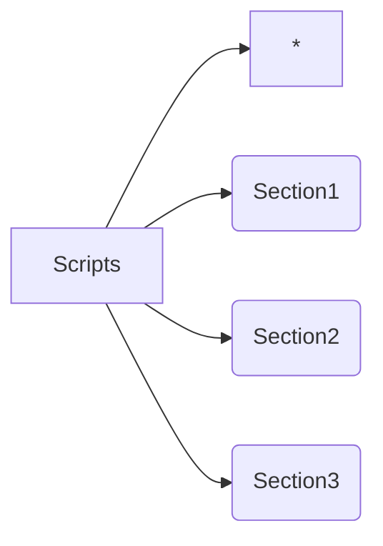
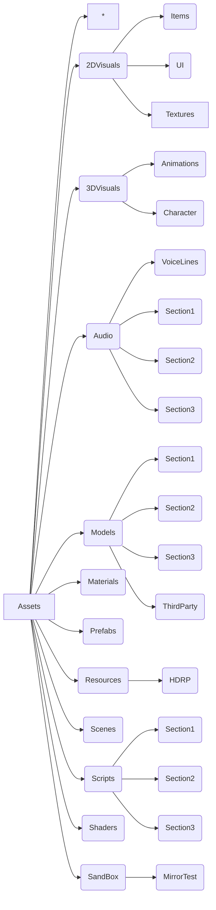

# Reflection Guidelines 
This document heavily draws from [this article on code structure](http://www.arreverie.com/blogs/unity3d-best-practices-folder-structure-source-control/) and [hits article on naming conventions](https://avangarde-software.com/unity-coding-guidelines-basic-best-practices/). Please have a read and you'll have  an understanding on the guide lines listed here.

The following will outline how we'll be naming and structuring our code. This is to ensure that all collaborative work on the codebase will be unified and make it easier to make future additions.

This document will also outline where to put every type of file that will be created in the game.

## File Structure
Each large Assets folder will contain three sub folders that pertain to each section of the game. For example, the **Scripts** folder will be structured accordingly,

Where any script that is not specific to any section will remain in the parent directory.

## Naming Conventions

### Folders
1. Use **pascal case**. E.g. `MirrorImplementation`, `Section2`
2. There should be **no spaces** in any folder names.
3. Always store assets into their respective **sections**.
4. Use the **ThirdParty** folder for any free assets taken online.
5. Use the **SandBox** folder for any experiments.

### Scripts
1. Use **pascal case**. E.g. `InteractNotes`, `MirrorConnector`
2. There should be **no spaces** in any scripts.
3. Keep the name of the scripts **descriptive**.

### Models/Audio Assets/2D Assets/3D Assets
1. Use **pothole/snake case**. E.g. `mouse_left.png`, `main_door.wav`
2. Keep the name of the scripts **descriptive**.

## Coding Conventions

Basically use pascal case for big things and camel case for small things. Adhere to [SOLID Design Principles](https://www.digitalocean.com/community/conceptual_articles/s-o-l-i-d-the-first-five-principles-of-object-oriented-design) and catch yourself making [smelly code](https://refactoring.guru/refactoring/smells).

### Classes & Methods
All in **pascal case**. Whenever you can, extract repeated code in it's own method or class to avoid repititions.

For example, `PlayerController.cs` or `InterpolateTransform.cs`.

Ensure to use Singleton classes. Whenever you have public variables, make sure you create a getter so that other classes need not get the entire component to speed up the code.

### Events and Delegates
Use these a lot when your object is making small calls that will suredly be repeated some where else such as playing audio on interaction. All events must have **On** before their name and all delegates should have **Callback** after their names.

For example, `ProcessUserCallback` and `UnityAction OnDeath`.

### Constants
All constants must appear at the top of the page and must be written in **upper pothole case / screaming snake case**. You should figure out if any of these constants are better suited to be in the `Globals.cs` script instead.

For example, `PITCH_MAX` or `FOOT_STEP_INTERVAL`. 

### Public Global Variables
If the class has any public variables that can be altered in the Inspector, have these appear after the **Constants** in an organized fasion. These variables will follow **camel back case**.

For example, `pickupDistance` or `stepCounter`.

### Variables
Any variables used will be in **camel back case**. If these are variables referencing components on the object the script is on, prepend `m_` to the variable to make this clear.

For example, `m_playerBody` or `jumpForce`.

### Static Variables

Use these whenever there's a method that does not depend on the current instance of the object you're calling it on. Use **pascal case**.

For example, `UserRotation`

## Synchronization

This Github repository will be used in tandem with the Reflection **Google Drive** that houses all collaborative documents and especially assets. 

**Do NOT commit assets larger than 50 MB to the Github Repository.** Upload it to the Google Drive and make note of any large asset used in your pull requests.

Always branch off of main into your own branch and avoid altering the main scene if possible. Always create prefabs and alter these so you never need to directly touch the main scene. Link prefabs to prefabs if you have to. Whenever you make a pull request communicate on the Reflections **Discord**.

## Publication

Following every week, a playable build should be created from our progress. This build will be attached to [Reflection Itch.io page](https://zuhab.itch.io/reflection) with a dev log.

We should try to make versioning a possibility even if it's only in name.